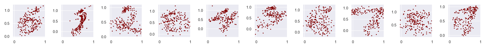
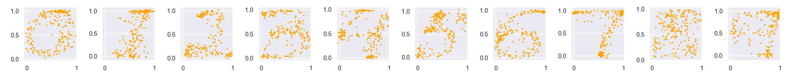
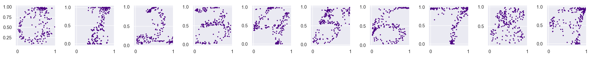
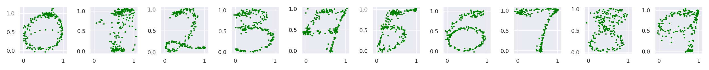

# Recognition-of-Handwriting-from-Electromyography
This project is based on [Recognition-of-Handwriting-from-Electromyography](https://journals.plos.org/plosone/article?id=10.1371/journal.pone.0006791). The original article used only a simple model (linear regression with Winner filter). We implemented more complex algorithms and assessed their quality.

## Results
Models we tried so far
 Linear Model |
 :---------|
|
 **XGBoost** |
|
 **Random Forest** |
|
 **LSTM** |
|